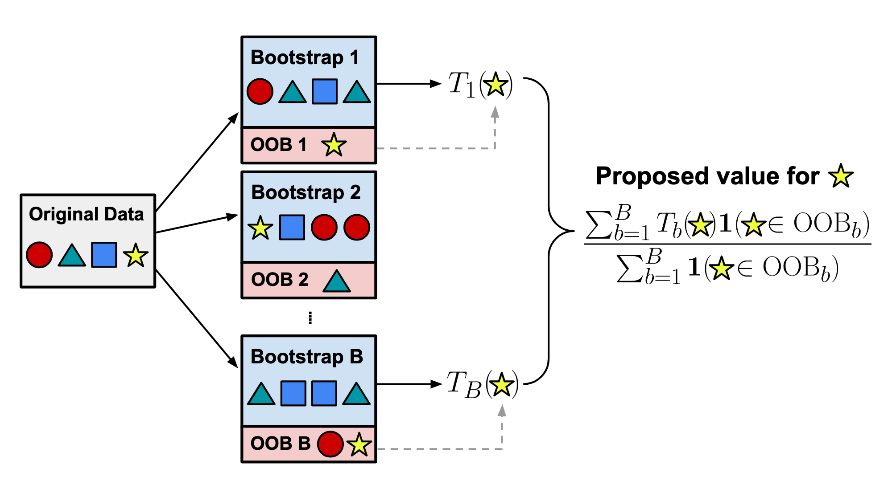

# Data-OOB: Out-of-bag Estimate as a Simple and Efficient Data Value

This repository provides an implementation of the paper [Data-OOB: Out-of-bag Estimate as a Simple and Efficient Data Value](https://arxiv.org/abs/2304.07718) accepted at [ICML 2023](https://icml.cc/Conferences/2023). Data-OOB is *computationally efficient* and can easily scale to millions of data. Our experiments demonstrate that Data-OOB significantly outperforms existing state-of-the-art data valuation methods in identifying mislabeled data points and finding a set of helpful (or harmful) data points, highlighting the potential for applying data values in real-world applications.

<p align="center">

</p>

### Quick start

We provide an easy-to-follow [Jupyter notebook](notebooks/Data-OOB-on-Magictelescope.ipynb), which demonstrates identification of mislabeled data points using Data-OOB (and existing data valuation methods). 


### Download OpenML datasets

To replicate experiments of [the paper](https://arxiv.org/abs/2304.07718), one first needs to download OpenML datasets. We provide an easy tool to download datasets. Run the following code at `dataoob/preprocess`. 
```
python download_openML_datasets.py --use_sample
```

### Authors

- Yongchan Kwon (yk3012 (at) columbia (dot) edu)

- James Zou (jamesz (at) stanford (dot) edu)


